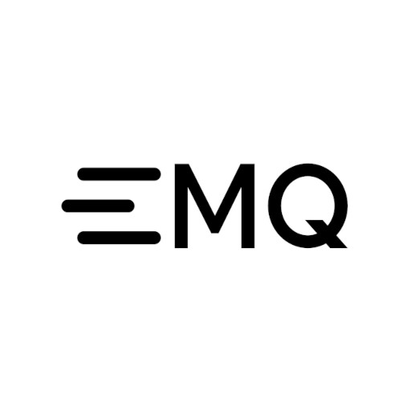

# Runtipi App Store ⛺

This is the official Runtipi App Store.
It contains all the apps that are available for download on [Runtipi](https://github.com/runtipi/runtipi).

> [!NOTE]
> This repository continues to receive updates; however, no new applications will be accepted. Please limit your pull requests to bug fixes. See [explanation](https://github.com/runtipi/runtipi/issues/2317#issuecomment-3217972183).

## How to add addtionals apps

- Use the `Add custom app` feature
- Add a [community-maintained store](https://github.com/runtipi/runtipi/discussions/categories/app-stores)
- Create [your own appstore](https://runtipi.io/docs/guides/create-your-own-app-store)

### Need help ?

- [Create a discussion](https://github.com/runtipi/runtipi-appstore/discussions)
- [Join the Discord](https://discord.gg/Bu9qEPnHsc)
- [Join the Forum](https://forums.runtipi.io/)

> *Don't forget to read the [docs](https://runtipi.io/docs)*

## Apps available (267)

|                                   App                                   | Name                                                                         | Description                                                                                                                                                         |
| :---------------------------------------------------------------------: | ---------------------------------------------------------------------------- | ------------------------------------------------------------------------------------------------------------------------------------------------------------------- |
|                     | [2FAuth](https://github.com/Bubka/2FAuth)                                    | Manage your Two-Factor Authentication codes.                                                                                                                        |
|               | [Activepieces](https://github.com/activepieces/activepieces)                 | True zapier alternative.                                                                                                                                            |
|              | [Actual Budget](https://github.com/actualbudget/actual)                      | Local-first OpenSource Budget tool                                                                                                                                  |
|                    | [Adguard](https://github.com/AdguardTeam)                                    | World's most advanced adblocker!                                                                                                                                    |
|           | [Adguard Home Sync](https://github.com/bakito/adguardhome-sync)              | Synchronize AdGuard Home config to replicas                                                                                                                         |
|                     | [AFFiNE](https://github.com/toeverything/affine)                             | AFFiNE is a workspace with fully merged docs, whiteboards and databases.                                                                                            |
|                       | [Anse](https://github.com/anse-app/anse)                                     | Fully optimized UI for AI Chats.                                                                                                                                    |
|                 | [ArchiveBox](https://github.com/ArchiveBox/ArchiveBox)                       | Open source self-hosted web archiving.                                                                                                                              |
|                      | [Atuin Server](https://github.com/atuinsh/atuin)                             | Magical Shell History                                                                                                                                               |
|             | [Audiobookshelf](https://github.com/advplyr/audiobookshelf)                  | Audiobookshelf is a self-hosted audiobook and podcast server.                                                                                                       |
|                | [Authentik](https://github.com/goauthentik/authentik)                        | The authentication glue you need.                                                                                                                                   |
|                    | [autobrr](https://github.com/autobrr/autobrr)                                | Automation for downloads.                                                                                                                                           |
|                     | [Baïkal](https://github.com/ckulka/baikal-docker)                            | Baïkal is a Calendar+Contacts server                                                                                                                                |
|                    | [Barrage](https://github.com/maulik9898/barrage)                             | Minimal Deluge WebUI with full mobile support                                                                                                                       |
|                     | [Bazarr](https://github.com/morpheus65535/bazarr)                            | A companion application to Sonarr and Radarr that manages and downloads subtitles                                                                                   |
|                     | [Beszel](https://github.com/henrygd/beszel)                                  | Lightweight server monitoring.                                                                                                                                      |
|               | [Beszel Agent](https://github.com/henrygd/beszel)                            | Agent software for Beszel.                                                                                                                                          |
|                   | [bewCloud](https://github.com/bewcloud/bewcloud)                             | The Simple Web Cloud Solution.                                                                                                                                      |
|                   | [Bitcoin](https://github.com/lncm/docker-bitcoind)                           | Bitcoin core node                                                                                                                                                   |
|                  | [Bitmagnet](https://github.com/bitmagnet-io/bitmagnet)                       | A self-hosted BitTorrent indexer.                                                                                                                                   |
|                  | [Booksonic](https://github.com/popeen/Booksonic-Air)                         | The selfhosted audiobook server                                                                                                                                     |
|                  | [Bookstack](https://github.com/BookStackApp/BookStack)                       | BookStack is a self-hosted platform for organising and storing information.                                                                                         |
|                   | [Budibase](https://github.com/Budibase/budibase)                             | Internal tools made easy.                                                                                                                                           |
|                     | [Cal.com](https://github.com/calcom/cal.com)                                 | Scheduling infrastructure for absolutely everyone.                                                                                                                  |
|                | [Calibre-Web - EBook Reader](https://github.com/janeczku/calibre-web)        | Calibre-web is a web app providing a clean interface for browsing, reading and downloading eBooks using an existing Calibre database.                               |
|            | [ChangeDetection](https://github.com/dgtlmoon/changedetection.io)            | Website change detection.                                                                                                                                           |
|                 | [ChatGPT UI](https://github.com/WongSaang/chatgpt-ui)                        | A ChatGPT web client that supports multiple users, multiple languages, and multiple database connections for persistent data storage                                |
|                    | [Chatpad AI](https://github.com/deiucanta/chatpad)                           | Not just another ChatGPT user-interface!                                                                                                                            |
|            | [Cheshire Cat AI](https://github.com/cheshire-cat-ai/core)                   | A production-ready AI framework to develop AI agents.                                                                                                               |
|            | [Cloudflare DDNS](https://github.com/joshuaavalon/docker-cloudflare)         | Update DNS records on Cloudflare.                                                                                                                                   |
|                | [Cloudflared](https://github.com/WisdomSky/Cloudflared-web)                  | Cloudflare Tunnels in a Web UI                                                                                                                                      |
|                | [Code Server](https://github.com/coder/code-server)                          | VS Code in the browser                                                                                                                                              |
|                 | [CodeX.docs](https://github.com/codex-team/codex.docs)                       | Free Docs app powered by Editor.js ecosystem.                                                                                                                       |
|                     | [Crafty](https://gitlab.com/crafty-controller/crafty-4)                      | Python based Control Panel for your Minecraft Server                                                                                                                |
|                 | [Cross-Seed](https://github.com/cross-seed/cross-seed)                       | Fully-automatic cross-seeding with Torznab.                                                                                                                         |
|                   | [Crowdsec](https://github.com/crowdsecurity/crowdsec)                        | Participative security solution offering crowdsourced protection against malicious IPs and access to the most advanced real-world CTI.                              |
|                       | [CTFd](https://github.com/CTFd/CTFd)                                         | Cyber Security Training made simple.                                                                                                                                |
|                        | [Cup](https://github.com/sergi0g/cup)                                        | The easiest way to check for your container updates.                                                                                                                |
|                  | [CyberChef](https://github.com/gchq/CyberChef)                               | The Cyber Swiss Army Knife                                                                                                                                          |
|                   | [DailyTxT](https://github.com/PhiTux/DailyTxT)                               | Encrypted Diary Web-App                                                                                                                                             |
|                    | [Dash.](https://github.com/MauriceNino/dashdot)                              | A simple, modern server dashboard, primarily used by smaller private server                                                                                         |
|                      | [Dashy](https://github.com/lissy93/dashy)                                    | A self-hostable personal dashboard built for you.                                                                                                                   |
|                    | [Databag](https://github.com/balzack/databag)                                | Messenger for the Decentralized Web                                                                                                                                 |
|               | [DDNS Updater](https://github.com/qdm12/ddns-updater)                        | Program to keep DNS A and/or AAAA records updated for multiple DNS providers.                                                                                       |
|                     | [Deemix](https://gitlab.com/Bockiii/deemix-docker)                           | deemix is a barebone deezer downloader library built from the ashes of Deezloader Remix.                                                                            |
|                     | [Deluge](https://github.com/linuxserver/docker-deluge)                       | Deluge is a lightweight, Free Software, cross-platform BitTorrent client.                                                                                           |
|                     | [Dockge](https://github.com/louislam/dockge)                                 | Docker compose.yaml stack-oriented manager.                                                                                                                         |
|                    | [Docmost](https://github.com/docmost/docmost)                                | An open-source collaborative wiki and documentation software                                                                                                        |
|                   | [DokuWiki](https://github.com/dokuwiki/dokuwiki)                             | DokuWiki is a simple to use and highly versatile Open Source wiki software                                                                                          |
|                     | [Dozzle](https://github.com/amir20/dozzle)                                   | Dozzle is a small web based app to monitor Docker logs                                                                                                              |
|                     | [Draw.io](https://github.com/jgraph/drawio)                                  | Diagramming and whiteboarding app.                                                                                                                                  |
|                    | [Duck DNS](https://github.com/linuxserver/docker-duckdns)                    | Duck DNS is a free Dynamic DNS service                                                                                                                              |
|                  | [Duplicati](https://github.com/linuxserver/docker-duplicati)                 | Store securely encrypted backups in the cloud!                                                                                                                      |
|          | [Eclipse Mosquitto](https://github.com/eclipse/mosquitto/)                   | The MQTT protocol provides a lightweight method of carrying out messaging using a publish/subscribe model.                                                          |
|                    | [Electrs](https://github.com/romanz/electrs)                                 | Electrum server                                                                                                                                                     |
|         | [Email OAuth2 Proxy](https://github.com/simonrob/email-oauth2-proxy)         | OAuth Proxy for IMAP/POP/SMTP.                                                                                                                                      |
|                       | [Emby](https://emby.media)                                                   | A media server for your home collection                                                                                                                             |
|                       | [EMQX Open Source](https://github.com/emqx/emqx)                             | Scalable open-source MQTT broker.                                                                                                                                   |
|                 | [Emulatorjs](https://github.com/EmulatorJS/EmulatorJS)                       | Self-hosted Javascript emulation for various system.                                                                                                                |
|                    | [ESP Home](https://github.com/esphome/esphome)                               | Control your ESP8266/ESP32.                                                                                                                                         |
|                 | [Excalidraw](https://github.com/excalidraw/excalidraw)                       | Online whiteboard collaboration made easy                                                                                                                           |
|                | [File Browser](https://github.com/filebrowser/filebrowser)                   | Access your homeserver files from your browser                                                                                                                      |
|                  | [Filestash](https://github.com/mickael-kerjean/filestash)                    | A modern web client for SFTP, S3, FTP, WebDAV, Git, Minio, LDAP, CalDAV, CardDAV, Mysql, Backblaze                                                                  |
|                | [Firefly III](https://github.com/firefly-iii/firefly-iii)                    | Firefly III: a personal finances manager                                                                                                                            |
|  | [Firefly III Data Importer](https://github.com/firefly-iii/data-importer)    | The Firefly III Data Importer can import data into Firefly III                                                                                                      |
|                  | [Fireshare](https://github.com/ShaneIsrael/fireshare)                        | Self host your media and share with unique links                                                                                                                    |
|               | [Flaresolverr](https://github.com/FlareSolverr/FlareSolverr)                 | Bypass Cloudflare and DDoS-GuARD.                                                                                                                                   |
|                  | [flatnotes](https://github.com/Dullage/flatnotes)                            | A self-hosted, database-less note taking web app                                                                                                                    |
|                  | [Flightlog](https://github.com/perdian/flightlog/)                           | Flightlog, a web application that keeps track of your personal flight history                                                                                       |
|                    | [Flowise AI](https://github.com/FlowiseAI/Flowise)                           | Build LLM Apps Easily                                                                                                                                               |
|                    | [Forgejo](https://codeberg.org/forgejo/forgejo/)                             | Beyond coding. We forge. · Lightweight and performant · Guaranteed 100% Free Software                                                                               |
|                   | [FreshRSS](https://github.com/FreshRSS/FreshRSS)                             | A free, self-hostable aggregator…                                                                                                                                   |
|              | [gandi-livedns](https://github.com/jbbodart/gandi-livedns)                   | Update your Gandi DNS zone records with your WAN IP                                                                                                                 |
|                      | [Ghost Production](https://github.com/TryGhost/Ghost)                        | Ghost - Turn your audience into a business.                                                                                                                         |
|                  | [Ghost Development](https://github.com/TryGhost/Ghost)                       | Ghost - Turn your audience into a business.                                                                                                                         |
|                 | [Ghostfolio](https://github.com/ghostfolio/ghostfolio)                       | Open Source Wealth Management Software.                                                                                                                             |
|                      | [Gitea](https://github.com/go-gitea/gitea)                                   | Gitea - Git with a cup of tea · A painless self-hosted Git service. · Cross-platform · Easy to install · Lightweight · Open Source.                                 |
|                     | [Gladys Assistant](https://github.com/gladysassistant/gladys)                | A privacy-first, open-source home assistant                                                                                                                         |
|                     | [Glance](https://github.com/glanceapp/glance)                                | Super configurable dashboard                                                                                                                                        |
|                    | [Glances](https://github.com/nicolargo/glances)                              | An eye on your system                                                                                                                                               |
|                     | [Gotify](https://github.com/gotify/server)                                   | Gotify, a simple server for sending and receiving notification messages.                                                                                            |
|                 | [GoToSocial](https://github.com/superseriousbusiness/gotosocial)             | Fast, fun, ActivityPub server, powered by Go.                                                                                                                       |
|                    | [Grafana](https://github.com/grafana/grafana)                                | The open and composable observability and data visualization platform.                                                                                              |
|                  | [Gramps Web](https://github.com/gramps-project/gramps-web)                   | Web app for collaborative genealogy.                                                                                                                                |
|                       | [Grav](https://github.com/getgrav/grav)                                      | Grav is a Fast, Simple, and Flexible, file-based Web-platform.                                                                                                      |
|                      | [Grist](https://github.com/gristlabs/grist-core)                             | Grist is the evolution of spreadsheets.                                                                                                                             |
|                      | [Grocy](https://github.com/grocy/grocy)                                      | ERP beyond your fridge                                                                                                                                              |
|                  | [Guacamole](https://github.com/apache/guacamole-server)                      | Clientless remote desktop gateway                                                                                                                                   |
|                       | [Halo](https://github.com/halo-dev/halo)                                     | Halo - Open source website building tool.                                                                                                                           |
|                    | [Hammond](https://github.com/alfhou/hammond)                                 | Self hosted vehicle and expense management system. Like Clarkson, but better                                                                                        |
|                      | [Haven](https://github.com/havenweb/haven)                                   | Self-hostable private blogging.                                                                                                                                     |
|                   | [HedgeDoc](https://github.com/hedgedoc/hedgedoc)                             | A Collaborative Markdown and Note Taking App                                                                                                                        |
|                   | [Heimdall](https://github.com/linuxserver/Heimdall)                          | Application Dashboard                                                                                                                                               |
|                | [Hello World](https://github.com/crccheck/docker-hello-world)                | Hello World web server in under 2 MB                                                                                                                                |
|                    | [Hoarder](https://github.com/hoarder-app/hoarder)                            | Self-hostable bookmark-everything app                                                                                                                               |
|                   | [Homarr](https://github.com/homarr-labs/homarr)                              | Homarr is a simple and lightweight homepage for your server, that helps you easily access all of your services in one place.                                        |
|            | [Home Assistant](https://github.com/home-assistant/core)                     | Open source home automation that puts local control and privacy first                                                                                               |
|                    | [HomeBox](https://github.com/sysadminsmedia/homebox)                         | Inventory and organization system.                                                                                                                                  |
|                 | [Home Bridge](https://github.com/homebridge/homebridge)                      | HomeKit support for the impatient.                                                                                                                                  |
|                   | [Homepage](https://github.com/gethomepage/homepage)                          | A highly customizable homepage                                                                                                                                      |
|                      | [Homer](https://github.com/bastienwirtz/homer)                               | A very simple static homepage for your server                                                                                                                       |
|                     | [Immich](https://github.com/immich-app/immich)                               | Photo and video backup solution directly from your mobile phone.                                                                                                    |
|                   | [Inspircd](https://github.com/inspircd/inspircd)                             | A modular C++ IRC server.                                                                                                                                           |
|                  | [Invidious](https://github.com/iv-org/invidious)                             | An alternative front-end to YouTube                                                                                                                                 |
|              | [Invoice Ninja](https://github.com/invoiceninja/invoiceninja)                | Invoices, Expenses and Tasks built with Laravel, Flutter and React.                                                                                                 |
|                   | [IT-Tools](https://github.com/CorentinTh/it-tools)                           | Collection of handy online tools for developers, with great UX.                                                                                                     |
|                    | [Jackett](https://github.com/Jackett/Jackett)                                | API Support for your favorite torrent trackers                                                                                                                      |
|                   | [Jellyfin](https://github.com/jellyfin/jellyfin)                             | A media server for your home collection                                                                                                                             |
|               | [Jellyfin Vue (Beta)](https://github.com/jellyfin/jellyfin-vue)              | A modern web client for Jellyfin based on Vue                                                                                                                       |
|                 | [Jellyseerr](https://github.com/Fallenbagel/jellyseerr)                      | Fork of overseerr for Jellyfin support                                                                                                                              |
|                     | [Joplin Server](https://github.com/laurent22/joplin)                         | Note taking and to-do application with synchronisation                                                                                                              |
|                   | [Kanboard](https://github.com/kanboard/kanboard)                             | Open Source Kanban Board                                                                                                                                            |
|                   | [Kapowarr](https://github.com/Casvt/Kapowarr)                                | Kapowarr is a software to build and manage a comic book library, fitting in the \*arr suite of software.                                                            |
|            | [Kasm Workspaces](https://github.com/kasmtech)                               | Container streaming platform.                                                                                                                                       |
|                     | [Kavita](https://github.com/Kareadita/Kavita)                                | Kavita is a fast, feature rich, cross platform reading server                                                                                                       |
|                      | [Kimai](https://github.com/kimai/kimai)                                      | Open source time-tracker                                                                                                                                            |
|                | [Kiwix Server](https://github.com/kiwix/kiwix-tools/)                        | Kiwix Server is a web server for hosting .zim files                                                                                                                 |
|                | [Koillection](https://github.com/benjaminjonard/koillection)                 | Koillection allow you to manage any kind of collections.                                                                                                            |
|                     | [Kometa](https://github.com/Kometa-Team/Kometa)                              | Overlays, Collections & Playlists for Plex.                                                                                                                         |
|                      | [Komga](https://github.com/gotson/komga)                                     | A media server for your comics, mangas, BDs, magazines and eBooks.                                                                                                  |
|                | [LibrePhotos](https://github.com/LibrePhotos/librephotos)                    | Complete photo management service                                                                                                                                   |
|                 | [LibreSpeed](https://github.com/librespeed/speedtest)                        | No Flash, No Java, No Websocket, No Garbage                                                                                                                         |
|             | [LibreTranslate](https://github.com/LibreTranslate/LibreTranslate)           | Free and Open Source Machine Translation API. 100% self-hosted, offline capable and easy to setup.                                                                  |
|                     | [Lidarr](https://github.com/Lidarr/Lidarr)                                   | Looks and smells like Sonarr but made for music.                                                                                                                    |
|              | [Lidarr on Steroids](https://github.com/youegraillot/lidarr-on-steroids)     | Lidarr with some muscles thanks to deemix                                                                                                                           |
|                  | [LinkStack](https://github.com/LinkStackOrg/linkstack-docker)                | LinkStack is a highly customizable link sharing platform with an intuitive, easy to use user interface                                                              |
|                 | [Linkwarden](https://github.com/linkwarden/linkwarden)                       | A self-hosted, open-source collaborative bookmark manager                                                                                                           |
|                  | [Lobe Chat](https://github.com/lobehub/lobe-chat)                            | LLM chatbot framework                                                                                                                                               |
|             | [Lodestone Core](https://github.com/Lodestone-Team/lodestone_core)           | Server hosting tool for Minecraft and other multiplayers.                                                                                                           |
|                      | [Logto](https://github.com/logto-io/logto)                                   | Logto is a cost-effective open-source alternative to Auth0.                                                                                                         |
|                 | [LubeLogger](https://github.com/hargata/lubelog)                             | Vehicle Maintenance and Fuel Mileage Tracker.                                                                                                                       |
|                | [Maintainerr](https://github.com/jorenn92/Maintainerr)                       | Maintainerr will manage the storage space on your plex server, launching automated actions to delete your files.                                                    |
|                   | [Mastodon](https://github.com/mastodon/mastodon)                             | Your self-hosted, globally interconnected microblogging community                                                                                                   |
|             | [Conduit](https://gitlab.com/famedly/conduit)                                | Conduit is a simple, fast and reliable chat server written in Rust                                                                                                  |
|              | [Matter Server](https://github.com/home-assistant-libs/python-matter-server) | Interact with Matter. Works with HA !                                                                                                                               |
|              | [MDNS Repeater](https://github.com/angelnu/docker-mdns_repeater)             | Re-broadcast mDNS packets.                                                                                                                                          |
|                   | [Mealie](https://github.com/hay-kot/mealie)                                  | Mealie is a self-hosted recipe manager and meal planner.                                                                                                            |
|                      | [Memos](https://github.com/usememos/memos)                                   | Memo hub for knowledge management and collaboration.                                                                                                                |
|                    | [Mempool](https://github.com/mempool/mempool)                                | Bitcoin mempool visualizer and blockchain explorer                                                                                                                  |
|                   | [Metabase](https://github.com/metabase/metabase)                             | The simplest, fastest way to get business intelligence and analytics to everyone in your company                                                                    |
|                     | [MeTube](https://github.com/alexta69/metube)                                 | Self-hosted YouTube downloader.                                                                                                                                     |
|                       | [Mind](https://github.com/Casvt/MIND)                                        | A simple self hosted reminder platform that uses push to send notifications to your device.                                                                         |
|           | [Minecraft Server](https://github.com/itzg/docker-minecraft-server)          | Run a minecraft server                                                                                                                                              |
|                      | [Minio](https://github.com/minio/minio)                                      | High Performance Object Storage.                                                                                                                                    |
|                    | [Mixpost](https://github.com/inovector/mixpost)                              | Self-hosted social media management. Schedule and organize your social content.                                                                                     |
|                | [Mixpost Pro](https://github.com/inovector/mixpost)                          | Self-hosted social media management. Schedule and organize your social content.                                                                                     |
|                | [Moneroblock](https://github.com/duggavo/MoneroBlock)                        | Decentralized and trustless Monero block explorer                                                                                                                   |
|                    | [Monero Daemon](https://github.com/sethforprivacy/simple-monerod-docker)     | Monero is a private, decentralized cryptocurrency that keeps your finances confidential and secure.                                                                 |
|                      | [MongoDB](https://github.com/mongodb/mongo)                                  | MongoDB is an open-source NoSQL database                                                                                                                            |
|              | [Mongo Express](https://github.com/mongo-express/mongo-express)              | Web-based MongoDB admin interface, written with Node.js and Express                                                                                                 |
|                     | [Monica](https://github.com/monicahq/monica)                                 | A Personal Relationship Management tool to help you document your social life.                                                                                      |
|                    | [Moodist](https://github.com/remvze/moodist)                                 | Ambient sounds for focus and calm.                                                                                                                                  |
|                     | [Movary](https://github.com/leepeuker/movary)                                | Movary is a self-hosted web application to track and rate your watched movies.                                                                                      |
|                      | [MQTTX](https://github.com/emqx/MQTTX/)                                      | MQTT websocket browser client tool                                                                                                                                  |
|                    | [mStream Music](https://github.com/IrosTheBeggar/mStream)                    | The easiest music streaming server available                                                                                                                        |
|                     | [Mylar3](https://github.com/mylar3/mylar3)                                   | Mylar3 is an automated Comic Book downloader (cbr/cbz) for use with NZB and torrents written in python.                                                             |
|                      | [n8n](https://github.com/n8n-io/n8n)                                         | Workflow Automation Tool. Alternative to Zapier                                                                                                                     |
|                  | [Navidrome](https://github.com/navidrome/navidrome/)                         | A selfhosted music server                                                                                                                                           |
|                 | [Netboot.xyz](https://github.com/netbootxyz/netboot.xyz)                     | Your favorite operating systems in one place.                                                                                                                       |
|                    | [Netdata](https://github.com/netdata/netdata)                                | Open-source, real-time, performance and health monitoring.                                                                                                          |
|                  | [Nextcloud](https://github.com/nextcloud/server)                             | Productivity platform that keeps you in control                                                                                                                     |
|             | [Nextcloud Mini](https://github.com/nextcloud/server)                        | A safe home for all your data.                                                                                                                                      |
|                    | [NextGBA](https://github.com/nicotsx/nextgba)                                | Gameboy in your browser                                                                                                                                             |
|                      | [Nginx](https://github.com/nginx/nginx)                                      | Open-source simple and fast web server.                                                                                                                             |
|                     | [Nitter](https://github.com/zedeus/nitter)                                   | Twitter without annoyances!                                                                                                                                         |
|                     | [NocoDB](https://github.com/nocodb/nocodb)                                   | Open Source Airtable Alternative                                                                                                                                    |
|                    | [Node-RED](https://github.com/node-red/node-red)                             | Low-code programming for event-driven applications                                                                                                                  |
|                   | [Notemark](https://github.com/enchant97/note-mark/)                          | Lighting fast web-based Markdown notes app.                                                                                                                         |
|                       | [Ntfy](https://github.com/binwiederhier/ntfy)                                | Ntfy, a simple server for sending and receiving notification messages.                                                                                              |
|          | [Obsidian LiveSync](https://github.com/vrtmrz/self-hosted-livesync-server)   | LiveSync couchdb backend for Obsidian                                                                                                                               |
|                    | [Octobot](https://github.com/Drakkar-Software/OctoBot)                       | Octobot is a powerful open-source cryptocurrency trading robot.                                                                                                     |
|                       | [Odoo](https://github.com/odoo/odoo)                                         | Open-source business management software with modular applications for streamlined operations.                                                                      |
|                   | [Olivetin](https://github.com/OliveTin/OliveTin)                             | Give safe and simple access to predefined shell commands from a web interface.                                                                                      |
|                 | [Ollama - AMD](https://github.com/ollama/ollama)                             | LLMs inference server with OpenAI compatible API                                                                                                                    |
|                 | [Ollama - CPU](https://github.com/ollama/ollama)                             | LLMs inference server with OpenAI compatible API                                                                                                                    |
|              | [Ollama - Nvidia](https://github.com/ollama/ollama)                          | LLMs inference server with OpenAI compatible API                                                                                                                    |
|                     | [OneDev](https://code.onedev.io/onedev/server)                               | Self-hosted Git Server with Kanban and CI/CD                                                                                                                        |
|                 | [Open WebUI](https://github.com/open-webui/open-webui)                       | User-friendly WebUI for LLMs                                                                                                                                        |
|                  | [openbooks](https://github.com/evan-buss/openbooks)                          | Search and Download eBooks                                                                                                                                          |
|                    | [Outline](https://github.com/outline/outline)                                | A home for all your docs                                                                                                                                            |
|                  | [Overseerr](https://github.com/sct/overseerr)                                | Request management and media discovery tool for the Plex ecosystem                                                                                                  |
|                    | [Owncast](https://github.com/owncast/owncast)                                | Take control over your live stream video by running it yourself. Streaming + chat out of the box.                                                                   |
|                   | [Owncloud](https://github.com/owncloud/core)                                 | A personal cloud which runs on your own server.                                                                                                                     |
|                   | [PairDrop](https://github.com/schlagmichdoch/PairDrop)                       | Local file sharing in your browser. Inspired by Apple's AirDrop                                                                                                     |
|              | [Paperless-ngx](https://github.com/paperless-ngx/paperless-ngx)              | Document Management System (DMS)                                                                                                                                    |
|                     | [Penpot](https://github.com/penpot/penpot)                                   | Open-Source design & prototyping platform.                                                                                                                          |
|                 | [Peppermint](https://github.com/Peppermint-Lab/peppermint)                   | An open source ticket management & help desk solution.                                                                                                              |
|                 | [PhotoPrism](https://github.com/photoprism/photoprism)                       | AI-Powered Photos App for the Decentralized Web. We are on a mission to protect your freedom and privacy.                                                           |
|                     | [Pi-hole](https://github.com/pi-hole/pi-hole)                                | A black hole for Internet advertisements                                                                                                                            |
|                  | [Pinchflat](https://github.com/kieraneglin/pinchflat)                        | Your next YouTube media manager                                                                                                                                     |
|              | [Pingvin Share](https://github.com/stonith404/pingvin-share)                 | Self-hosted file sharing platform                                                                                                                                   |
|                     | [Planka](https://github.com/plankanban/planka)                               | Free open source kanban board for workgroups.                                                                                                                       |
|             | [Planning Poker](https://github.com/axeleroy/self-host-planning-poker)       | Online planning poker for scrum master.                                                                                                                             |
|               | [Plausible CE](https://github.com/plausible/community-edition)               | Simple, open-source, lightweight (< 1 KB) and privacy-friendly web analytics alternative to Google Analytics.                                                       |
|                       | [Plex](https://github.com/plexinc/pms-docker)                                | Stream Movies & TV Shows                                                                                                                                            |
|                   | [PodFetch](https://github.com/SamTV12345/PodFetch)                           | A sleek and efficient podcast downloader.                                                                                                                           |
|                  | [Portainer](https://github.com/portainer/portainer)                          | Making Docker and Kubernetes management easy.                                                                                                                       |
|              | [Postfix Mail Relay](https://github.com/shamil/docker-postfix-relay)         | Simple SMTP relay for environments where you may have private servers with no Internet connection.                                                                  |
|                 | [PrivateBin](https://github.com/PrivateBin/PrivateBin)                       | A minimalist, open source online pastebin where the server has zero knowledge of pasted data. Data is encrypted/decrypted in the browser using 256 bits AES.        |
|                   | [Prowlarr](https://github.com/Prowlarr/Prowlarr/)                            | A torrent/usenet indexer manager/proxy                                                                                                                              |
|                | [qBittorrent](https://github.com/qbittorrent/qBittorrent)                    | Fast, easy, and free BitTorrent client                                                                                                                              |
|                   | [qDirStat](https://github.com/linuxserver/docker-qdirstat)                   | A graphical disk usage analyzer                                                                                                                                     |
|                     | [Radarr](https://github.com/Radarr/Radarr)                                   | Movie collection manager for Usenet and BitTorrent users.                                                                                                           |
|                     | [Rallly](https://github.com/lukevella/rallly)                                | Scheduling and collaboration tool                                                                                                                                   |
|                    | [Readarr](https://github.com/Readarr/Readarr)                                | Book Manager and Automation (Sonarr for Ebooks)                                                                                                                     |
|                  | [Recyclarr](https://github.com/recyclarr/recyclarr)                          | Sync TRaSH Guides.                                                                                                                                                  |
|               | [Resilio](https://github.com/bt-sync)                                        | Fast, reliable, and simple file sync and share solution.                                                                                                            |
|                       | [RomM](https://github.com/rommapp/romm)                                      | Your beautiful, powerful, self-hosted rom manager.                                                                                                                  |
|                        | [RSS](https://github.com/ssddanbrown/rss)                                    | A simple, opinionated, RSS feed aggregator.                                                                                                                         |
|                     | [RSSHub](https://github.com/DIYgod/RSSHub)                                   | Everything is RSSible with RSSHub                                                                                                                                   |
|                       | [Ryot](https://github.com/IgnisDa/ryot)                                      | Roll your own tracker!                                                                                                                                              |
|                    | [SABnzbd](https://github.com/sabnzbd/sabnzbd)                                | Sabnzbd makes Usenet as simple and streamlined as possible by automating everything we can                                                                          |
|                   | [Scrypted](https://github.com/koush/scrypted)                                | High performance home video integration and automation platform                                                                                                     |
|                    | [SearXNG](https://github.com/searxng/searxng)                                | Privacy-respecting, hackable metasearch engine                                                                                                                      |
|                   | [SeedSync](https://github.com/ipsingh06/seedsync)                            | SeedSync is a tool to sync the files on a remote Linux server.                                                                                                      |
|                  | [Semaphore](https://github.com/semaphoreui/semaphore)                        | Modern UI for Ansible, Terraform, OpenTofu, Bash, Pulumi.                                                                                                           |
|                       | [Send](https://gitlab.com/timvisee/send)                                     | Simple, private file sharing. https://send.vis.ee/                                                                                                                  |
|                      | [Serge](https://github.com/serge-chat/serge)                                 | LLaMA made easy                                                                                                                                                     |
|                     | [SFTPGo](https://github.com/drakkan/sftpgo)                                  | Fully featured and highly configurable SFTP server                                                                                                                  |
|                     | [Shlink](https://github.com/shlinkio/shlink)                                 | Shlink is a self-hosted URL shortener                                                                                                                               |
|               | [Silverbullet](https://github.com/silverbulletmd/silverbullet)               | SilverBullet is a creative space where you collect, create and expand your personal knowledge, while also letting you constantly evolve the tools you use to do so. |
|                | [SimpleX SMP](https://github.com/simplex-chat/simplexmq)                     | A reference implementation of the SimpleX Messaging Protocol for simplex queues over public networks.                                                               |
|                     | [SiYuan](https://github.com/siyuan-note/siyuan)                              | SiYuan is a privacy-first personal knowledge management system.                                                                                                     |
|                      | [SLSKD](https://github.com/slskd/slskd)                                      | P2P downloads                                                                                                                                                       |
|                   | [Smallweb](https://github.com/pomdtr/smallweb)                               | Your internet folder                                                                                                                                                |
|                     | [Sonarr](https://github.com/Sonarr/Sonarr)                                   | TV show manager for Usenet and BitTorrent                                                                                                                           |
|                 | [Spacedrive](https://github.com/spacedriveapp/spacedrive)                    | Cross-platform file explorer                                                                                                                                        |
|          | [Speedtest Tracker](https://github.com/alexjustesen/speedtest-tracker)       | Internet performance tracking application.                                                                                                                          |
|                   | [Spoolman](https://github.com/Donkie/Spoolman)                               | Keep track of your inventory of 3D-printer filament spools                                                                                                          |
|                   | [Sshwifty](https://github.com/nirui/sshwifty)                                | Web SSH & Telnet (WebSSH & WebTelnet client)                                                                                                                        |
|              | [Stalwart Mail](https://github.com/stalwartlabs)                             | Open-source mail server solution with JMAP, IMAP4, and SMTP support                                                                                                 |
|               | [Stirling-PDF](https://github.com/Frooodle/Stirling-PDF/)                    | Powerful locally hosted web based PDF manipulation tool.                                                                                                            |
|                   | [Suwayomi](https://github.com/Suwayomi/docker-tachidesk)                     | An open-source manga reader server with bundled Web UI                                                                                                              |
|                  | [Syncthing](https://github.com/syncthing)                                    | Peer-to-peer file synchronization between your devices                                                                                                              |
|                  | [Tailscale](https://github.com/tailscale/tailscale)                          | The easiest, most secure way to use WireGuard and 2FA.                                                                                                              |
|                    | [Tandoor](https://github.com/TandoorRecipes/recipes)                         | Recipe collection manager.                                                                                                                                          |
|                   | [Tasks.md](https://github.com/BaldissaraMatheus/Tasks.md)                    | A self-hosted, file based task management board.                                                                                                                    |
|                   | [Tautulli](https://github.com/Tautulli/Tautulli)                             | Monitoring and tracking tool for Plex Media Server.                                                                                                                 |
|                   | [Tinyauth](https://github.com/steveiliop56/tinyauth)                         | The simplest way to protect your apps with a login screen.                                                                                                          |
|                    | [Tooljet](https://github.com/ToolJet/ToolJet)                                | Alternative to retool to construct CRM dashboard                                                                                                                    |
|       | [Traefik Certs Dumper](https://github.com/kereis/traefik-certs-dumper)       | Dumps Let's Encrypt certificates of a specified domain which Traefik stores in acme.json.                                                                           |
|               | [Transmission](https://github.com/transmission/transmission)                 | Fast, easy, and free BitTorrent client                                                                                                                              |
|           | [Transmission (VPN)](https://github.com/haugene/docker-transmission-openvpn) | BitTorrent client with VPN support.                                                                                                                                 |
|                    | [Trilium](https://github.com/TriliumNext/Trilium)                            | An open-source, self-hosted Notion alterative                                                                                                                       |
|              | [Tube Archivist](https://github.com/tubearchivist/tubearchivist)             | Your self-hosted YouTube media server                                                                                                                               |
|            | [Umami Analytics](https://github.com/umami-software/umami)                   | Umami is a simple, fast, privacy-focused alternative to Google Analytics.                                                                                           |
|                    | [Unmanic](https://github.com/Unmanic/unmanic)                                | Unmanic - Library Optimiser.                                                                                                                                        |
|                | [Uptime Kuma](https://github.com/louislam/uptime-kuma)                       | A fancy self-hosted monitoring tool.                                                                                                                                |
|                | [VaultWarden](https://github.com/dani-garcia/vaultwarden)                    | All your passwords in your control!                                                                                                                                 |
|                   | [ViewTube](https://github.com/ViewTube/viewtube)                             | The open source, privacy-conscious way to enjoy your favorite YouTube content.                                                                                      |
|                    | [Vikunja](https://kolaente.dev/vikunja)                                      | The Todo-app to organize your life.                                                                                                                                 |
|                     | [Wallos](https://github.com/ellite/Wallos)                                   | Open-Source Personal Subscription Tracker                                                                                                                           |
|               | [WatchYourLAN](https://github.com/aceberg/WatchYourLAN)                      | Lightweight network IP scanner                                                                                                                                      |
|                      | [Wekan](https://github.com/wekan/wekan)                                      | Open-Source, customizable, and privacy-focused kanban                                                                                                               |
|                    | [Wireguard](https://github.com/wg-easy/wg-easy)                              | VPN server for your homeserver.                                                                                                                                     |
|                   | [Whisparr](https://github.com/Whisparr/Whisparr)                             | Adult movie collection manager.                                                                                                                                     |
|                     | [Whoami](https://github.com/traefik/whoami)                                  | Tiny Go server that prints os information and HTTP request to output.                                                                                               |
|                    | [Whoogle Search](https://github.com/benbusby/whoogle-search)                 | A self-hosted, ad-free, privacy-respecting metasearch engine.                                                                                                       |
|                     | [WikiJS](https://github.com/requarks/wiki)                                   | A modern and powerful wiki app built on Node.js                                                                                                                     |
|                    | [Windows](https://github.com/dockur/windows/)                                | Full windows vm in your browser                                                                                                                                     |
|                     | [Wizarr](https://github.com/Wizarrrr/wizarr)                                 | Wizarr is an automatic user invitation system for Plex and Jellyfin.                                                                                                |
|                  | [WordPress](https://github.com/WordPress/WordPress)                          | Popular CMS for websites and blogs                                                                                                                                  |
|               | [Write-Freely](https://hub.docker.com/r/nephatrine/write-freely)             | Markdown-based publishing platform.                                                                                                                                 |
|               | [Your Spotify](https://github.com/Yooooomi/your_spotify)                     | Self hosted Spotify tracking dashboard.                                                                                                                             |
|                   | [ZeroTier](https://github.com/zerotier/ZeroTierOne)                          | Easy to use zero configuration VPN.                                                                                                                                 |
|                | [Zigbee2MQTT](https://github.com/Koenkk/zigbee2mqtt)                         | Zigbee to MQTT bridge                                                                                                                                               |
|                    | [Zipline](https://github.com/diced/zipline)                                  | A ShareX/file upload server that is easy to use, packed with features, and with an easy setup!                                                                      |

## Code requirements

1. Install **[Node.js](https://nodejs.org/en)** on your machine
2. Install **[pnpm](https://pnpm.io/installation)** package manager
3. Install dependencies (from the root of the project)

```bash
pnpm install
```
