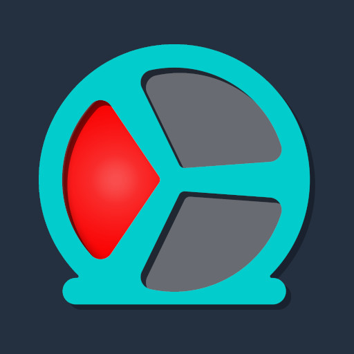

# Tipi App Store ⛺️

This is the official repository for the Tipi App Store. It contains all the apps that are available for download on [Tipi](https://github.com/runtipi/runtipi).

## Apps available

| Icon                                                                                                             | Name                                                                           | Description                                                                                                                                                         | Port  |
| ---------------------------------------------------------------------------------------------------------------- | ------------------------------------------------------------------------------ | ------------------------------------------------------------------------------------------------------------------------------------------------------------------- | ----- |
|                | [Mixpost Pro](https://github.com/inovector/mixpost)                            | Self-hosted social media management. Schedule and organize your social content.                                                                                     | 8191  |
|                  | [Syncthing](https://github.com/syncthing)                                      | Peer-to-peer file synchronization between your devices                                                                                                              | 8090  |
|                 | [Emulatorjs](https://github.com/EmulatorJS/EmulatorJS)                         | Self-hosted Javascript emulation for various system.                                                                                                                | 8164  |
|                 | [Ollama - CPU](https://github.com/ollama/ollama)                               | LLMs inference server with OpenAI compatible API                                                                                                                    | 11436 |
|              | [Actual Budget](https://github.com/actualbudget/actual-server)                 | Local-first OpenSource Budget tool                                                                                                                                  | 8011  |
|                  | [Nextcloud](https://github.com/nextcloud/server)                               | Productivity platform that keeps you in control                                                                                                                     | 8083  |
|             | [Conduit](https://gitlab.com/famedly/conduit)                                  | Conduit is a simple, fast and reliable chat server written in Rust                                                                                                  | 6167  |
|                 | [GoToSocial](https://github.com/superseriousbusiness/gotosocial)               | Fast, fun, ActivityPub server, powered by Go.                                                                                                                       | 8188  |
|                     | [Movary](https://github.com/leepeuker/movary)                                  | Movary is a self-hosted web application to track and rate your watched movies.                                                                                      | 8155  |
|                | [Calibre-Web - EBook Reader](https://github.com/janeczku/calibre-web)          | Calibre-web is a web app providing a clean interface for browsing, reading and downloading eBooks using an existing Calibre database.                               | 8100  |
|                 | [CodeX.docs](https://github.com/codex-team/codex.docs)                         | Free Docs app powered by Editor.js ecosystem.                                                                                                                       | 8101  |
|                      | [Grocy](https://github.com/grocy/grocy)                                        | ERP beyond your fridge                                                                                                                                              | 8136  |
|                   | [Kanboard](https://github.com/kanboard/kanboard)                               | Open Source Kanban Board                                                                                                                                            | 8010  |
|                     | [Penpot](https://github.com/penpot/penpot)                                     | Open-Source design & prototyping platform.                                                                                                                          | 8645  |
|                   | [Kapowarr](https://github.com/Casvt/Kapowarr)                                  | Kapowarr is a software to build and manage a comic book library, fitting in the \*arr suite of software.                                                            | 8194  |
|                  | [Get A Shell](https://github.com/steveiliop56/getashell)                       | SSH shells from a Web UI                                                                                                                                            | 8281  |
|              | [Invoice Ninja](https://github.com/invoiceninja/invoiceninja)                  | Invoices, Expenses and Tasks built with Laravel, Flutter and React.                                                                                                 | 8881  |
|                    | [Trilium](https://github.com/zadam/trilium)                                    | An open-source, self-hosted Notion alterative                                                                                                                       | 8267  |
|                   | [SeedSync](https://github.com/ipsingh06/seedsync)                              | SeedSync is a tool to sync the files on a remote Linux server.                                                                                                      | 8800  |
|                | [Firefly III](https://github.com/firefly-iii/firefly-iii)                      | Firefly III: a personal finances manager                                                                                                                            | 8115  |
|                  | [Duplicati](https://github.com/linuxserver/docker-duplicati)                   | Store securely encrypted backups in the cloud!                                                                                                                      | 8159  |
|                  | [Lobe Chat](https://github.com/lobehub/lobe-chat)                              | LLM chatbot framework                                                                                                                                               | 3210  |
|                | [Uptime Kuma](https://github.com/louislam/uptime-kuma)                         | A fancy self-hosted monitoring tool.                                                                                                                                | 8125  |
|                      | [SLSKD](https://github.com/slskd/slskd)                                        | P2P downloads                                                                                                                                                       | 5030  |
|                    | [mStream Music](https://github.com/IrosTheBeggar/mStream)                      | The easiest music streaming server available                                                                                                                        | 8162  |
|                   | [Bitcoin](https://github.com/lncm/docker-bitcoind)                             | Bitcoin core node                                                                                                                                                   | 8333  |
|                     | [Bazarr](https://github.com/morpheus65535/bazarr)                              | A companion application to Sonarr and Radarr that manages and downloads subtitles                                                                                   | 6767  |
|                   | [Notemark](https://github.com/enchant97/note-mark/)                            | Lighting fast web-based Markdown notes app.                                                                                                                         | 8567  |
|           | [Minecraft Server](https://github.com/itzg/docker-minecraft-server)            | Run a minecraft server                                                                                                                                              | 25565 |
|             | [Audiobookshelf](https://github.com/advplyr/audiobookshelf)                    | Audiobookshelf is a self-hosted audiobook and podcast server.                                                                                                       | 13378 |
|              | [gandi-livedns](https://github.com/jbbodart/gandi-livedns)                     | Update your Gandi DNS zone records with your WAN IP                                                                                                                 | 8134  |
|                       | [Grav](https://github.com/getgrav/grav)                                        | Grav is a Fast, Simple, and Flexible, file-based Web-platform.                                                                                                      | 8161  |
|                     | [NocoDB](https://github.com/nocodb/nocodb)                                     | Open Source Airtable Alternative                                                                                                                                    | 8146  |
|                    | [Netdata](https://github.com/netdata/netdata)                                  | Open-source, real-time, performance and health monitoring.                                                                                                          | 19999 |
|                      | [Wekan](https://github.com/wekan/wekan)                                        | Open-Source, customizable, and privacy-focused kanban                                                                                                               | 8678  |
|            | [Cloudflare DDNS](https://github.com/joshuaavalon/docker-cloudflare)           | Update DNS records on Cloudflare.                                                                                                                                   | 22222 |
|                     | [Monica](https://github.com/monicahq/monica)                                   | A Personal Relationship Management tool to help you document your social life.                                                                                      | 3291  |
|                   | [qDirStat](https://github.com/linuxserver/docker-qdirstat)                     | A graphical disk usage analyzer                                                                                                                                     | 7125  |
|                    | [Node-RED](https://github.com/node-red/node-red)                               | Low-code programming for event-driven applications                                                                                                                  | 8111  |
|                   | [Prowlarr](https://github.com/Prowlarr/Prowlarr/)                              | A torrent/usenet indexer manager/proxy                                                                                                                              | 8109  |
|                      | [Memos](https://github.com/usememos/memos)                                     | Memo hub for knowledge management and collaboration.                                                                                                                | 5230  |
|                     | [Kavita](https://github.com/Kareadita/Kavita)                                  | Kavita is a fast, feature rich, cross platform reading server                                                                                                       | 8175  |
|                   | [DokuWiki](https://github.com/dokuwiki/dokuwiki)                               | DokuWiki is a simple to use and highly versatile Open Source wiki software                                                                                          | 8149  |
|                   | [Homepage](https://github.com/gethomepage/homepage)                            | A highly customizable homepage                                                                                                                                      | 8756  |
|                | [LibrePhotos](https://github.com/LibrePhotos/librephotos)                      | Complete photo management service                                                                                                                                   | 8132  |
|                  | [Plausible](https://github.com/plausible/analytics)                            | Simple, open-source, lightweight (< 1 KB) and privacy-friendly web analytics alternative to Google Analytics.                                                       | 8190  |
|                   | [Spoolman](https://github.com/Donkie/Spoolman)                                 | Keep track of your inventory of 3D-printer filament spools                                                                                                          | 7912  |
|                   | [Jellyfin](https://github.com/jellyfin/jellyfin)                               | A media server for your home collection                                                                                                                             | 8091  |
|                    | [Octobot](https://github.com/Drakkar-Software/OctoBot)                         | Octobot is a powerful open-source cryptocurrency trading robot.                                                                                                     | 8825  |
|                    | [Duck DNS](https://github.com/linuxserver/docker-duckdns)                      | Duck DNS is a free Dynamic DNS service                                                                                                                              | 8026  |
|                    | [Tandoor](https://github.com/TandoorRecipes/recipes)                           | Recipe collection manager.                                                                                                                                          | 8341  |
|                    | [Adguard](https://github.com/AdguardTeam)                                      | World's most advanced adblocker!                                                                                                                                    | 8104  |
|                  | [Filestash](https://github.com/mickael-kerjean/filestash)                      | A modern web client for SFTP, S3, FTP, WebDAV, Git, Minio, LDAP, CalDAV, CardDAV, Mysql, Backblaze                                                                  | 8189  |
|                  | [WordPress](https://github.com/WordPress/WordPress)                            | Popular CMS for websites and blogs                                                                                                                                  | 8213  |
|                      | [Umami](https://github.com/umami-software/umami)                               | Umami is a simple, fast, privacy-focused alternative to Google Analytics.                                                                                           | 8147  |
|                    | [Moodist](https://github.com/remvze/moodist)                                   | Ambient sounds for focus and calm.                                                                                                                                  | 8221  |
|                | [qBittorrent](https://github.com/qbittorrent/qBittorrent)                      | Fast, easy, and free BitTorrent client                                                                                                                              | 8133  |
|                   | [Mastodon](https://github.com/mastodon/mastodon)                               | Your self-hosted, globally interconnected microblogging community                                                                                                   | 8210  |
|          | [Eclipse Mosquitto](https://github.com/eclipse/mosquitto/)                     | open source message broker                                                                                                                                          | 8288  |
|                     | [Baïkal](https://github.com/ckulka/baikal-docker)                              | Baïkal is a Calendar+Contacts server                                                                                                                                | 6556  |
|                  | [Fireshare](https://github.com/ShaneIsrael/fireshare)                          | Self host your media and share with unique links                                                                                                                    | 8140  |
|                    | [Dash.](https://github.com/MauriceNino/dashdot)                                | A simple, modern server dashboard, primarily used by smaller private server                                                                                         | 8173  |
|                | [Koillection](https://github.com/benjaminjonard/koillection)                   | Koillection allow you to manage any kind of collections.                                                                                                            | 8050  |
|                     | [Joplin Server](https://github.com/laurent22/joplin)                           | Note taking and to-do application with synchronisation                                                                                                              | 8099  |
|                     | [Immich](https://github.com/immich-app/immich)                                 | Photo and video backup solution directly from your mobile phone.                                                                                                    | 8128  |
|                 | [Netboot.xyz](https://github.com/netbootxyz/netboot.xyz)                       | Your favorite operating systems in one place.                                                                                                                       | 8675  |
|                 | [Home Bridge](https://github.com/homebridge/homebridge)                        | HomeKit support for the impatient.                                                                                                                                  | 8581  |
|                    | [Databag](https://github.com/balzack/databag)                                  | Messenger for the Decentralized Web                                                                                                                                 | 8201  |
|                      | [Logto](https://github.com/logto-io/logto)                                     | Logto is a cost-effective open-source alternative to Auth0.                                                                                                         | 8203  |
|                     | [Shlink](https://github.com/shlinkio/shlink)                                   | Shlink is a self-hosted URL shortener                                                                                                                               | 8207  |
|                  | [Booksonic](https://github.com/popeen/Booksonic-Air)                           | The selfhosted audiobook server                                                                                                                                     | 8040  |
|             | [LibreTranslate](https://github.com/LibreTranslate/LibreTranslate)             | Free and Open Source Machine Translation API. 100% self-hosted, offline capable and easy to setup.                                                                  | 8121  |
|                     | [Nitter](https://github.com/zedeus/nitter)                                     | Twitter without annoyances!                                                                                                                                         | 8106  |
|                  | [Portainer](https://github.com/portainer/portainer)                            | Making Docker and Kubernetes management easy.                                                                                                                       | 9443  |
|                 | [Cross-Seed](https://github.com/cross-seed/cross-seed)                         | Fully-automatic cross-seeding with Torznab.                                                                                                                         | 2468  |
|                       | [Odoo](https://github.com/odoo/odoo)                                           | Open-source business management software with modular applications for streamlined operations.                                                                      | 8017  |
|                     | [Dockge](https://github.com/louislam/dockge)                                   | Docker compose.yaml stack-oriented manager.                                                                                                                         | 8768  |
|       | [Traefik Certs Dumper](https://github.com/kereis/traefik-certs-dumper)         | Dumps Let's Encrypt certificates of a specified domain which Traefik stores in acme.json.                                                                           | 9999  |
|                        | [RSS](https://github.com/ssddanbrown/rss)                                      | A simple, opinionated, RSS feed aggregator.                                                                                                                         | 8141  |
|                     | [Deluge](https://github.com/linuxserver/docker-deluge)                         | Deluge is a lightweight, Free Software, cross-platform BitTorrent client.                                                                                           | 8144  |
|                   | [Owncloud](https://github.com/owncloud/core)                                   | A personal cloud which runs on your own server.                                                                                                                     | 8151  |
|                  | [Authentik](https://github.com/goauthentik/authentik)                          | The authentication glue you need.                                                                                                                                   | 8770  |
|                       | [Ntfy](https://github.com/binwiederhier/ntfy)                                  | Ntfy, a simple server for sending and receiving notification messages.                                                                                              | 8166  |
|                 | [PhotoPrism](https://github.com/photoprism/photoprism)                         | AI-Powered Photos App for the Decentralized Web. We are on a mission to protect your freedom and privacy.                                                           | 8110  |
|                    | [Unmanic](https://github.com/Unmanic/unmanic)                                  | Unmanic - Library Optimiser.                                                                                                                                        | 8256  |
|                    | [Vikunja](https://kolaente.dev/vikunja)                                        | The Todo-app to organize your life.                                                                                                                                 | 8135  |
|                     | [MeTube](https://github.com/alexta69/metube)                                   | youtube-dl web UI                                                                                                                                                   | 8250  |
|                    | [HomeBox](https://github.com/hay-kot/homebox)                                  | Homebox is the inventory and organization system built for the Home User                                                                                            | 7745  |
|                  | [Bookstack](https://github.com/BookStackApp/BookStack)                         | BookStack is a self-hosted platform for organising and storing information.                                                                                         | 8119  |
|            | [Home Assistant](https://github.com/home-assistant/core)                       | Open source home automation that puts local control and privacy first                                                                                               | 8209  |
|                    | [SABnzbd](https://github.com/sabnzbd/sabnzbd)                                  | Sabnzbd makes Usenet as simple and streamlined as possible by automating everything we can                                                                          | 8168  |
|                   | [Crowdsec](https://github.com/crowdsecurity/crowdsec)                          | Participative security solution offering crowdsourced protection against malicious IPs and access to the most advanced real-world CTI.                              | 8679  |
|                       | [Halo](https://github.com/halo-dev/halo)                                       | Halo - Open source website building tool.                                                                                                                           | 8092  |
|                   | [Scrypted](https://github.com/koush/scrypted)                                  | High performance home video integration and automation platform                                                                                                     | 10443 |
|                    | [SearXNG](https://github.com/searxng/searxng)                                  | Privacy-respecting, hackable metasearch engine                                                                                                                      | 8127  |
|                     | [Planka](https://github.com/plankanban/planka)                                 | Free open source kanban board for workgroups.                                                                                                                       | 8016  |
|                    | [Grafana](https://github.com/grafana/grafana)                                  | The open and composable observability and data visualization platform                                                                                               | 8160  |
|                 | [Excalidraw](https://github.com/excalidraw/excalidraw)                         | Online whiteboard collaboration made easy                                                                                                                           | 8172  |
|                | [Maintainerr](https://github.com/jorenn92/Maintainerr)                         | Maintainerr will manage the storage space on your plex server, launching automated actions to delete your files.                                                    | 8030  |
|                   | [FreshRSS](https://github.com/FreshRSS/FreshRSS)                               | A free, self-hostable aggregator…                                                                                                                                   | 8086  |
|                    | [Mixpost](https://github.com/inovector/mixpost)                                | Self-hosted social media management. Schedule and organize your social content.                                                                                     | 8167  |
|                    | [Owncast](https://github.com/owncast/owncast)                                  | Take control over your live stream video by running it yourself. Streaming + chat out of the box.                                                                   | 8198  |
|                | [Hello World](https://github.com/crccheck/docker-hello-world)                  | Hello World web server in under 2 MB                                                                                                                                | 8000  |
|          | [Obsidian LiveSync](https://github.com/vrtmrz/self-hosted-livesync-server)     | LiveSync couchdb backend for Obsidian                                                                                                                               | 5984  |
|                      | [Minio](https://github.com/minio/minio)                                        | High Performance Object Storage                                                                                                                                     | 8001  |
|                     | [Radarr](https://github.com/Radarr/Radarr)                                     | Movie collection manager for Usenet and BitTorrent users.                                                                                                           | 8088  |
|                    | [Barrage](https://github.com/maulik9898/barrage)                               | Minimal Deluge WebUI with full mobile support                                                                                                                       | 8145  |
|              | [Tube Archivist](https://github.com/tubearchivist/tubearchivist)               | Your self-hosted YouTube media server                                                                                                                               | 8120  |
|                      | [Haven](https://github.com/havenweb/haven)                                     | Self-hostable private blogging                                                                                                                                      | 8130  |
|                   | [Mealie](https://github.com/hay-kot/mealie)                                    | Mealie is a self-hosted recipe manager and meal planner.                                                                                                            | 8220  |
|               | [Stirling-PDF](https://github.com/Frooodle/Stirling-PDF/)                      | Powerful locally hosted web based PDF manipulation tool.                                                                                                            | 8234  |
|                   | [Budibase](https://github.com/Budibase/budibase)                               | Internal tools made easy.                                                                                                                                           | 8268  |
|                      | [Ghost](https://github.com/TryGhost/Ghost)                                     | Ghost - Turn your audience into a business.                                                                                                                         | 8117  |
|                    | [Chatpad AI](https://github.com/deiucanta/chatpad)                             | Not just another ChatGPT user-interface!                                                                                                                            | 8179  |
|                     | [AFFiNE](https://github.com/toeverything/affine)                               | AFFiNE is a workspace with fully merged docs, whiteboards and databases.                                                                                            | 3010  |
|                       | [Ryot](https://github.com/IgnisDa/ryot)                                        | Roll your own tracker!                                                                                                                                              | 8206  |
|                    | [Hammond](https://github.com/alfhou/hammond)                                   | Self hosted vehicle and expense management system. Like Clarkson, but better                                                                                        | 8185  |
|               | [Resilio](https://github.com/bt-sync)                                          | Resilio Sync is a fast, reliable, and simple file sync and share solution, powered by P2P technology                                                                | 8113  |
|                     | [Rallly](https://github.com/lukevella/rallly)                                  | Scheduling and collaboration tool                                                                                                                                   | 8208  |
|              | [Lidarr on Steroids](https://github.com/youegraillot/lidarr-on-steroids)       | Lidarr with some muscles thanks to deemix                                                                                                                           | 8186  |
|                    | [autobrr](https://github.com/autobrr/autobrr)                                  | Automation for downloads.                                                                                                                                           | 8158  |
|            | [Kasm Workspaces](https://github.com/kasmtech)                                 | Container streaming platform.                                                                                                                                       | 8744  |
|  | [Firefly III Data Importer](https://github.com/firefly-iii/data-importer)      | The Firefly III Data Importer can import data into Firefly III                                                                                                      | 8150  |
|                  | [Flightlog](https://github.com/perdian/flightlog/)                             | Flightlog, a web application that keeps track of your personal flight history                                                                                       | 8934  |
|              | [Postfix Mail Relay](https://github.com/shamil/docker-postfix-relay)           | Simple SMTP relay for environments where you may have private servers with no Internet connection.                                                                  | 2525  |
|                | [Code-Server - Web VS Code](https://github.com/linuxserver/docker-code-server) | Code-server is VS Code running on a remote server, accessible through the browser.                                                                                  | 8138  |
|              | [Ollama - Nvidia](https://github.com/ollama/ollama)                            | LLMs inference server with OpenAI compatible API                                                                                                                    | 11435 |
|                      | [Gitea](https://github.com/go-gitea/gitea)                                     | Gitea - Git with a cup of tea · A painless self-hosted Git service. · Cross-platform · Easy to install · Lightweight · Open Source.                                 | 8108  |
|                    | [NextGBA](https://github.com/meienberger/nextgba)                              | Gameboy in your browser                                                                                                                                             | 8435  |
|                     | [Draw.io](https://github.com/jgraph/drawio)                                    | Diagramming and whiteboarding app.                                                                                                                                  | 8734  |
|                     | [2FAuth](https://github.com/Bubka/2FAuth)                                      | Manage your Two-Factor Authentication codes.                                                                                                                        | 8235  |
|                     | [RSSHub](https://github.com/DIYgod/RSSHub)                                     | Everything is RSSible with RSSHub                                                                                                                                   | 8223  |
|                    | [Outline](https://github.com/outline/outline)                                  | A home for all your docs                                                                                                                                            | 8404  |
|                     | [Gladys Assistant](https://github.com/gladysassistant/gladys)                  | A privacy-first, open-source home assistant                                                                                                                         | 8270  |
|                   | [DailyTxT](https://github.com/PhiTux/DailyTxT)                                 | Encrypted Diary Web-App                                                                                                                                             | 8156  |
|                      | [Nginx](https://github.com/nginx/nginx)                                        | Open-source simple and fast web server.                                                                                                                             | 8754  |
|                  | [Invidious](https://github.com/iv-org/invidious)                               | An alternative front-end to YouTube                                                                                                                                 | 8095  |
|            | [Cheshire Cat AI](https://github.com/cheshire-cat-ai/core)                     | A production-ready AI framework to develop AI agents.                                                                                                               | 1865  |
|                     | [Revolt Chat](https://github.com/revoltchat)                                   | Open source user-first chat platform.                                                                                                                               | 8272  |
|               | [Your Spotify](https://github.com/Yooooomi/your_spotify)                       | Self hosted Spotify tracking dashboard.                                                                                                                             | 8103  |
|                | [Zigbee2MQTT](https://github.com/Koenkk/zigbee2mqtt)                           | Zigbee to MQTT bridge                                                                                                                                               | 8290  |
|              | [Mongo Express](https://github.com/mongo-express/mongo-express)                | Web-based MongoDB admin interface, written with Node.js and Express                                                                                                 | 8087  |
|                      | [Dashy](https://github.com/lissy93/dashy)                                      | A self-hostable personal dashboard built for you.                                                                                                                   | 8205  |
|                     | [Crafty](https://gitlab.com/crafty-controller/crafty-4)                        | Python based Control Panel for your Minecraft Server                                                                                                                | 8456  |
|                      | [Komga](https://github.com/gotson/komga)                                       | A media server for your comics, mangas, BDs, magazines and eBooks.                                                                                                  | 2560  |
|                | [File Browser](https://github.com/filebrowser/filebrowser)                     | Access your homeserver files from your browser                                                                                                                      | 8096  |
|                  | [Tailscale](https://github.com/tailscale/tailscale)                            | The easiest, most secure way to use WireGuard and 2FA.                                                                                                              | 8093  |
|                  | [openbooks](https://github.com/evan-buss/openbooks)                            | Search and Download eBooks                                                                                                                                          | 8152  |
|                   | [ProxiTok](https://github.com/pablouser1/ProxiTok)                             | Open source alternative frontend for TikTok made using PHP                                                                                                          | 8118  |
|                 | [PrivateBin](https://github.com/PrivateBin/PrivateBin)                         | A minimalist, open source online pastebin where the server has zero knowledge of pasted data. Data is encrypted/decrypted in the browser using 256 bits AES.        | 8122  |
|                    | [Monero Daemon](https://github.com/sethforprivacy/simple-monerod-docker)       | Monero is a private, decentralized cryptocurrency that keeps your finances confidential and secure.                                                                 | 18080 |
|                | [Cloudflared](https://github.com/WisdomSky/Cloudflared-web)                    | Cloudflare Tunnels in a Web UI                                                                                                                                      | 14333 |
|                     | [Deemix](https://gitlab.com/Bockiii/deemix-docker)                             | deemix is a barebone deezer downloader library built from the ashes of Deezloader Remix.                                                                            | 6595  |
|                    | [Tooljet](https://github.com/ToolJet/ToolJet)                                  | Alternative to retool to construct CRM dashboard                                                                                                                    | 9876  |
|                       | [Plex](https://github.com/plexinc/pms-docker)                                  | Stream Movies & TV Shows                                                                                                                                            | 32400 |
|               | [Jellyfin Vue (Beta)](https://github.com/jellyfin/jellyfin-vue)                | A modern web client for Jellyfin based on Vue                                                                                                                       | 8202  |
|                    | [Flowise AI](https://github.com/FlowiseAI/Flowise)                             | Build LLM Apps Easily                                                                                                                                               | 8009  |
|                   | [Tautulli](https://github.com/Tautulli/Tautulli)                               | Monitoring and tracking tool for Plex Media Server.                                                                                                                 | 8181  |
|                       | [Mind](https://github.com/Casvt/MIND)                                          | A simple self hosted reminder platform that uses push to send notifications to your device.                                                                         | 8143  |
|                     | [Wallos](https://github.com/ellite/Wallos)                                     | Open-Source Personal Subscription Tracker                                                                                                                           | 8222  |
|                    | [Whoogle Search](https://github.com/benbusby/whoogle-search)                   | A self-hosted, ad-free, privacy-respecting metasearch engine.                                                                                                       | 8255  |
|                   | [PodFetch](https://github.com/SamTV12345/PodFetch)                             | A sleek and efficient podcast downloader.                                                                                                                           | 8177  |
|                | [Moneroblock](https://github.com/duggavo/MoneroBlock)                          | Decentralized and trustless Monero block explorer                                                                                                                   | 31312 |
|                     | [Gotify](https://github.com/gotify/server)                                     | Gotify, a simple server for sending and receiving notification messages.                                                                                            | 8129  |
|              | [Stalwart Mail](https://github.com/stalwartlabs)                               | Open-source mail server solution with JMAP, IMAP4, and SMTP support                                                                                                 | 8677  |
|                 | [Ollama - AMD](https://github.com/ollama/ollama)                               | LLMs inference server with OpenAI compatible API                                                                                                                    | 11434 |
|               | [Transmission](https://github.com/transmission/transmission)                   | Fast, easy, and free BitTorrent client                                                                                                                              | 8089  |
|                       | [RomM](https://github.com/zurdi15/romm)                                        | RomM (Rom Manager) is a web based retro roms manager integrated with IGDB.                                                                                          | 8178  |
|                   | [Tasks.md](https://github.com/BaldissaraMatheus/Tasks.md)                      | A self-hosted, file based task management board.                                                                                                                    | 8157  |
|                | [VaultWarden](https://github.com/dani-garcia/vaultwarden)                      | All your passwords in your control!                                                                                                                                 | 8107  |
|                    | [Readarr](https://github.com/Readarr/Readarr)                                  | Book Manager and Automation (Sonarr for Ebooks)                                                                                                                     | 8112  |
|                     | [Cal.com](https://github.com/calcom/cal.com)                                   | Scheduling infrastructure for absolutely everyone.                                                                                                                  | 8294  |
|                      | [MongoDB](https://github.com/mongodb/mongo)                                    | MongoDB is an open-source NoSQL database                                                                                                                            | 27017 |
|                   | [HedgeDoc](https://github.com/hedgedoc/hedgedoc)                               | A Collaborative Markdown and Note Taking App                                                                                                                        | 8142  |
|                  | [Recyclarr](https://github.com/recyclarr/recyclarr)                            | Sync TRaSH Guides.                                                                                                                                                  | 1111  |
|                   | [Sshwifty](https://github.com/nirui/sshwifty)                                  | Web SSH & Telnet (WebSSH & WebTelnet client)                                                                                                                        | 8274  |
|                     | [Lidarr](https://github.com/Lidarr/Lidarr)                                     | Looks and smells like Sonarr but made for music.                                                                                                                    | 8131  |
|                     | [OneDev](https://code.onedev.io/onedev/server)                                 | Self-hosted Git Server with Kanban and CI/CD                                                                                                                        | 6610  |
|                  | [LibReddit](https://github.com/spikecodes/libreddit)                           | Browse reddit without problems!                                                                                                                                     | 8105  |
|                    | [Wireguard](https://github.com/WeeJeWel/wg-easy/)                              | VPN server for your homeserver                                                                                                                                      | 8082  |
|                  | [Navidrome](https://github.com/navidrome/navidrome/)                           | A selfhosted music server                                                                                                                                           | 4533  |
|             | [Lodestone Core](https://github.com/Lodestone-Team/lodestone_core)             | Server hosting tool for Minecraft and other multiplayers                                                                                                            | 16662 |
|                   | [Whisparr](https://github.com/Whisparr/Whisparr)                               | Adult movie collection manager.                                                                                                                                     | 6969  |
|                       | [Anse](https://github.com/anse-app/anse)                                       | Fully optimized UI for AI Chats.                                                                                                                                    | 8014  |
|                      | [Grist](https://github.com/gristlabs/grist-core)                               | Grist is the evolution of spreadsheets.                                                                                                                             | 8484  |
|                     | [Mylar3](https://github.com/mylar3/mylar3)                                     | Mylar3 is an automated Comic Book downloader (cbr/cbz) for use with NZB and torrents written in python.                                                             | 8174  |
|                   | [ViewTube](https://github.com/ViewTube/viewtube)                               | The open source, privacy-conscious way to enjoy your favorite YouTube content.                                                                                      | 8180  |
|                 | [Ghostfolio](https://github.com/ghostfolio/ghostfolio)                         | Open Source Wealth Management Software.                                                                                                                             | 3333  |
|                 | [Linkwarden](https://github.com/linkwarden/linkwarden)                         | A self-hosted, open-source collaborative bookmark manager                                                                                                           | 8199  |
|                   | [ZeroTier](https://github.com/zerotier/ZeroTierOne)                            | Easy to use zero configuration VPN.                                                                                                                                 | 9993  |
|          | [Speedtest Tracker](https://github.com/alexjustesen/speedtest-tracker)         | Internet performance tracking application.                                                                                                                          | 8211  |
|                     | [SFTPGo](https://github.com/drakkan/sftpgo)                                    | Fully featured and highly configurable SFTP server                                                                                                                  | 8002  |
|                    | [Windows](https://github.com/dockur/windows/)                                  | Full windows vm in your browser                                                                                                                                     | 8006  |
|               | [Silverbullet](https://github.com/silverbulletmd/silverbullet)                 | SilverBullet is a creative space where you collect, create and expand your personal knowledge, while also letting you constantly evolve the tools you use to do so. | 8214  |
|                      | [Atuin Server](https://github.com/atuinsh/atuin)                               | Magical Shell History                                                                                                                                               | 8888  |
|                     | [Pi-hole](https://github.com/pi-hole/pi-hole)                                  | A black hole for Internet advertisements                                                                                                                            | 8081  |
|                   | [Heimdall](https://github.com/linuxserver/Heimdall)                            | Application Dashboard                                                                                                                                               | 8783  |
|                     | [WikiJS](https://github.com/requarks/wiki)                                     | A modern and powerful wiki app built on Node.js                                                                                                                     | 8148  |
|                     | [Wizarr](https://github.com/Wizarrrr/wizarr)                                   | Wizarr is an automatic user invitation system for Plex and Jellyfin.                                                                                                | 5690  |
|                   | [PairDrop](https://github.com/schlagmichdoch/PairDrop)                         | Local file sharing in your browser. Inspired by Apple's AirDrop                                                                                                     | 8182  |
|                      | [n8n](https://github.com/n8n-io/n8n)                                           | Workflow Automation Tool. Alternative to Zapier                                                                                                                     | 8215  |
|                   | [IT-Tools](https://github.com/CorentinTh/it-tools)                             | Collection of handy online tools for developers, with great UX.                                                                                                     | 8171  |
|         | [Email OAuth2 Proxy](https://github.com/simonrob/email-oauth2-proxy)           | OAuth Proxy for IMAP/POP/SMTP.                                                                                                                                      | 1999  |
|                    | [Forgejo](https://codeberg.org/forgejo/forgejo/)                               | Beyond coding. We forge. · Lightweight and performant · Guaranteed 100% Free Software                                                                               | 8195  |
|                     | [Homarr](https://github.com/ajnart/homarr)                                     | Homarr is a simple and lightweight homepage for your server, that helps you easily access all of your services in one place.                                        | 8102  |
|                       | [Send](https://gitlab.com/timvisee/send)                                       | Simple, private file sharing. https://send.vis.ee/                                                                                                                  | 8126  |
|               | [Flaresolverr](https://github.com/FlareSolverr/FlareSolverr)                   | Bypass Cloudflare and DDoS-GuARD.                                                                                                                                   | 8666  |
|            | [ChangeDetection](https://github.com/dgtlmoon/changedetection.io)              | Website change detection.                                                                                                                                           | 8257  |
|                  | [Overseerr](https://github.com/sct/overseerr)                                  | Request management and media discovery tool for the Plex ecosystem                                                                                                  | 8116  |
|                  | [LinkStack](https://github.com/LinkStackOrg/linkstack-docker)                  | LinkStack is a highly customizable link sharing platform with an intuitive, easy to use user interface                                                              | 8154  |
|                  | [Bitmagnet](https://github.com/bitmagnet-io/bitmagnet)                         | A self-hosted BitTorrent indexer.                                                                                                                                   | 3335  |
|                      | [Kimai](https://github.com/kimai/kimai)                                        | Open source time-tracker                                                                                                                                            | 8003  |
|              | [Paperless-ngx](https://github.com/paperless-ngx/paperless-ngx)                | Document Management System (DMS)                                                                                                                                    | 8012  |
|           | [Transmission (VPN)](https://github.com/haugene/docker-transmission-openvpn)   | BitTorrent client with VPN support.                                                                                                                                 | 9091  |
|                | [SimpleX SMP](https://github.com/simplex-chat/simplexmq)                       | A reference implementation of the SimpleX Messaging Protocol for simplex queues over public networks.                                                               | 5223  |
|                     | [Sonarr](https://github.com/Sonarr/Sonarr)                                     | TV show manager for Usenet and BitTorrent                                                                                                                           | 8098  |
|                 | [Jellyseerr](https://github.com/Fallenbagel/jellyseerr)                        | Fork of overseerr for Jellyfin support                                                                                                                              | 8163  |
|                     | [Dozzle](https://github.com/amir20/dozzle)                                     | Dozzle is a small web based app to monitor Docker logs                                                                                                              | 8013  |
|                 | [Peppermint](https://github.com/Peppermint-Lab/peppermint)                     | An open source ticket management & help desk solution.                                                                                                              | 8216  |
|                  | [Pinchflat](https://github.com/kieraneglin/pinchflat)                          | Your next YouTube media manager                                                                                                                                     | 8945  |
|                    | [Jackett](https://github.com/Jackett/Jackett)                                  | API Support for your favorite torrent trackers                                                                                                                      | 8097  |
|                    | [Glances](https://github.com/nicolargo/glances)                                | An eye on your system                                                                                                                                               | 8420  |
|                 | [ChatGPT UI](https://github.com/WongSaang/chatgpt-ui)                          | A ChatGPT web client that supports multiple users, multiple languages, and multiple database connections for persistent data storage                                | 8200  |
|                       | [CTFd](https://github.com/CTFd/CTFd)                                           | Cyber Security Training made simple.                                                                                                                                | 8546  |
|             | [Planning Poker](https://github.com/axeleroy/self-host-planning-poker)         | Online planning poker for scrum master.                                                                                                                             | 8880  |
|                | [Kiwix Server](https://github.com/kiwix/kiwix-tools/)                          | Kiwix Server is a web server for hosting .zim files                                                                                                                 | 8169  |
|               | [Activepieces](https://github.com/activepieces/activepieces)                   | True zapier alternative.                                                                                                                                            | 8605  |
|                    | [Zipline](https://github.com/diced/zipline)                                    | A ShareX/file upload server that is easy to use, packed with features, and with an easy setup!                                                                      | 8139  |
|                      | [Serge](https://github.com/serge-chat/serge)                                   | LLaMA made easy                                                                                                                                                     | 8008  |
|                  | [flatnotes](https://github.com/Dullage/flatnotes)                              | A self-hosted, database-less note taking web app                                                                                                                    | 8137  |
|                 | [ArchiveBox](https://github.com/ArchiveBox/ArchiveBox)                         | Open source self-hosted web archiving.                                                                                                                              | 8015  |

## How to sumbit an app

If you want to see new apps on Tipi you can either:

- [Create a discussion](https://github.com/runtipi/runtipi-appstore/discussions) on this repository and members of the community will add it
- [Join the Discord](https://discord.gg/Bu9qEPnHsc) members of the community will add it.
- Fork this repo and create the necessary files for a Tipi app. Follow this [guide](https://www.runtipi.io/docs/contributing/adding-a-new-app)`
