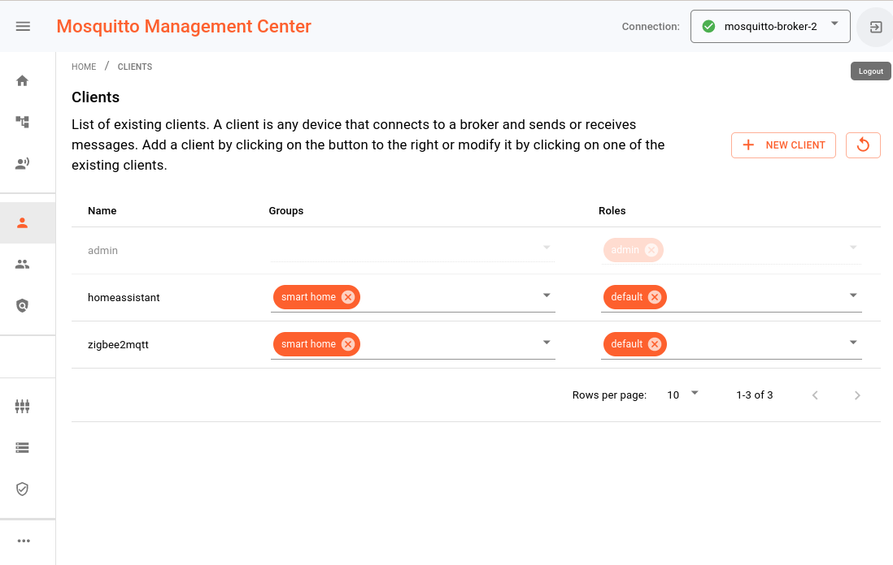

# Eclipse Mosquitto MQTT Broker with UI

this app consists of two images providing an mqtt broker and an UI for managing access to the broker.
The configuration is adapted from the github repo: [shantanoo-desai/mqtt-rbac-docker-init](https://github.com/shantanoo-desai/mqtt-rbac-docker-init)

## Eclipse Mosquitto

[Eclipse Mosquitto](https://mosquitto.org/) is an open source (EPL/EDL licensed) message broker that implements the MQTT protocol versions 5.0, 3.1.1 and 3.1. Mosquitto is lightweight and is suitable for use on all devices from low power single board computers to full servers.

Mosquitto is part of the [Eclipse Foundation](https://eclipse.org/), and is an [iot.eclipse.org project](https://iot.eclipse.org/). The development is driven by Cedalo.

The broker is configured by default that it listens to the port **1883** for tcp connections.
To also use websocket connection you can enable it by edit the `/runtipi/app-date/eclipse-mosquitto/data/config/moscquitto.conf` with the following content:

```
listener 9001
protocol websockets
```

## Cedalo Management Center

[Cedalo Management Center](https://github.com/cedalo/management-center) allows to easily manage, monitor and inspect instances of Eclipse Mosquitto. There are some pro features that can only be activated by getting a license from cedalo.



By default the following features are provided:

- A system dashboard to view key figures, showing broker traffic, license and client infos.
- Table of clients, which have connected to the broker, for inspection purposes.
- A topic tree, displaying those topics that have been addressed, while the MMC is running.
- Management of broker security allowing to modify clients, group and roles.
- A terminal to execute commands related to the dynamic security API
- Management Center infos and settings

The access to the broker is handled by the [dynamic-security plugin](https://mosquitto.org/documentation/dynamic-security/) in the mosquitto broker. The configuration is stored in the file `/runtipi/app-date/eclipse-mosquitto/data/config/dynamic-security.json`. This file is generated during the first launch of the the mosquitto image.


## Links

### See the following links for more information on MQTT:

- Community page: [http://mqtt.org/](http://mqtt.org/)
- MQTT v3.1.1 standard: [https://docs.oasis-open.org/mqtt/mqtt/v3.1.1/mqtt-v3.1.1.html](https://docs.oasis-open.org/mqtt/mqtt/v3.1.1/mqtt-v3.1.1.html)
- MQTT v5.0 standard: [https://docs.oasis-open.org/mqtt/mqtt/v5.0/mqtt-v5.0.html](https://docs.oasis-open.org/mqtt/mqtt/v5.0/mqtt-v5.0.html)

### Mosquitto project information is available at the following locations:

- Main homepage: [https://mosquitto.org/](https://mosquitto.org/)
- Find existing bugs or submit a new bug: [https://github.com/eclipse/mosquitto/issues](https://github.com/eclipse/mosquitto/issues)
- Source code repository: [https://github.com/eclipse/mosquitto](https://github.com/eclipse/mosquitto)

There is also a public test server available at [https://test.mosquitto.org/](https://test.mosquitto.org/)

### More information about the management center is available at the following locations:

- Main homepage: [https://cedalo.com/mqtt-broker-pro-mosquitto/](https://cedalo.com/mqtt-broker-pro-mosquitto/)
- Documentation: [https://docs.cedalo.com/mosquitto/management-center/introduction](https://docs.cedalo.com/mosquitto/management-center/introduction)
- Source code repository: [https://github.com/cedalo/management-center](https://github.com/cedalo/management-center)
