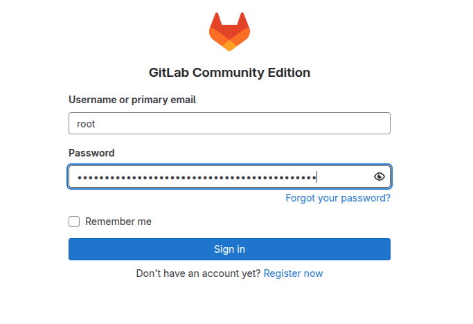

# A professional Git CI/CD service

These tutorials can help you learn how to use GitLab.

|                                                                                                                                 |                                                                                                                                                          |                                                                                                                                |
| ------------------------------------------------------------------------------------------------------------------------------- | -------------------------------------------------------------------------------------------------------------------------------------------------------- | ------------------------------------------------------------------------------------------------------------------------------ |
| [**Find your way around GitLab**](https://docs.gitlab.com/ee/tutorials/gitlab_navigation.html) Introduction to the product. | [**Learn Git**](https://docs.gitlab.com/ee/tutorials/learn_git.html) The basics of Git.                                                              | [**Plan and track your work**](https://docs.gitlab.com/ee/tutorials/plan_and_track.html) Planning, agile, issue boards.    |
| [**Build your application**](https://docs.gitlab.com/ee/tutorials/build_application.html) CI/CD fundamentals and examples.  | [**Secure your application and check compliance**](https://docs.gitlab.com/ee/tutorials/secure_application.html) Dependency and compliance scanning. | [**Manage your infrastructure**](https://docs.gitlab.com/ee/tutorials/infrastructure.html) GitOps, Kubernetes deployments. |
| [**Extend with GitLab**](https://docs.gitlab.com/ee/tutorials/develop.html) Integrations with third-party services.         |                                                                                                                                                          |                                                                                                                                |

## First Login

To login for the first time:

1. ssh to runtipi server node
2. "sudo docker ps" get \<containerId\> of gitlab image
3. sudo docker exec -it \<containerId\> grep 'Password:' /etc/gitlab/initial_root_password and take \<passwd\>
4. login in the app with username: root password: \<passwd\>
5. 
