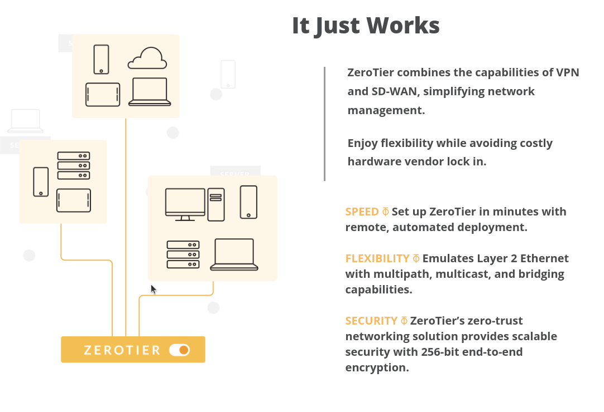

## Securely Connect Any Device, Anywhere.

ZeroTier combines the capabilities of VPN and SD-WAN, simplifying network management.
Connect team members from anywhere in the world on any device. ZeroTier creates secure networks between on-premise, cloud, desktop, and mobile devices.
Emulates Layer 2 Ethernet with multipath, multicast, and bridging capabilities.
ZeroTier’s zero-trust networking solution provides scalable security with 256-bit end-to-end encryption.

